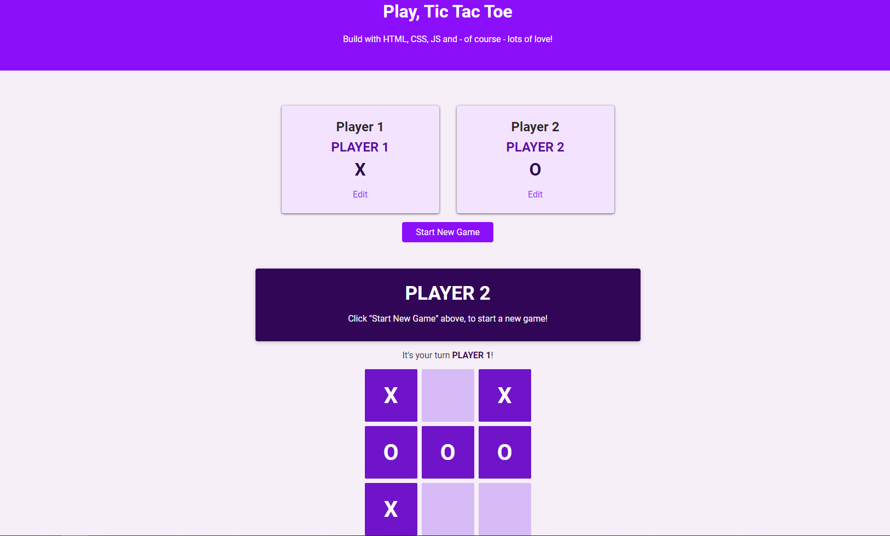

<h1 align="center">
  
</h1>

## 💻 Project

---

This repository was created to store the Tic Tac Toe Project, it has one page well styled and well-structured, and the purpose of this project is to practice the HTML5, CSS3 and JS concepts as:

- Configure Player Names
  - Form with input field in modal overlay;
  - Validate user input and show validation feedback.
- (Re-)Start the Game
  - "Start Game" button;
  - should clear current Game Board or "Game Over" message.
- Turn-based Gameplay
  - Turns should switch automatically between the two players;
  - Every player has his/her own symbol.
- Select Field & Check for Winner
  - Game fields are clickable & the player's symbol is displayed;
  - Check for winner (regular Tic-Tac-Toe rules) after every turn.
- Show "Game Over" Window
  - Present "Game Over" message which highlights winner (or draw) once the game ends

## 🧰 Technologies

---

This project was developed with the following technologies:

- HTML
- CSS
- JavaScript
- LiveServer

### 👀 Prerequisites

---

Before starting, you will need to have the following tools installed on your machine:<br/>
[Git](https://git-scm.com) to clone this repository<br/>
A code editor like [VSCode](https://code.visualstudio.com/) and, if you are using VSCode, you can use the [Live Server](https://marketplace.visualstudio.com/items?itemName=ritwickdey.LiveServer) extension to open the project.

### 👨‍💻 Running the Project

---

```bash
# Clone this repository
$ git clone https://github.com/Arthur-Ferreira/TicTacToe

# Access the project folder
$ cd TicTacToe

# If you're using the Live Server extension
# Right click in the "index.html" file and click in "Open With Live Server"
```

---
<p align="center">
Made with 🖤 by ARTHUR FERREIRA
</p>
